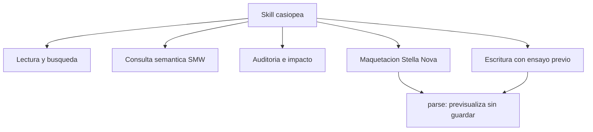

# casiopea-skill

Plugin y skill para operar [Casiopea](https://wiki.ead.pucv.cl), la wiki de la Escuela de Arquitectura y Diseño PUCV, desde un agente: Claude Code, Claude Cowork, o cualquier cliente que hable MCP.

## Primero lo importante: el bot eres tú

Esto no se conecta a Casiopea con una cuenta de servicio anónima que alguien administra en algún servidor. Se conecta con **un bot creado desde tu propia cuenta**, en [Special:BotPasswords](https://wiki.ead.pucv.cl/Special:BotPasswords). Un *bot password* de MediaWiki es una contraseña secundaria atada a tu usuario, con permisos que tú eliges, y que puedes revocar cuando quieras.

Las consecuencias, en orden de qué tan incómodo es descubrirlas tarde:

- **Todo lo que el agente escriba aparece firmado con tu nombre.** No dice "escrito por una IA". Dice `Hspencer`. En el historial. Para siempre. Casiopea guarda revisiones desde 2007 y no las borra.
- **Cualquier desastre lleva tu nombre.** Si el agente arruina una plantilla que usan cuatrocientas fichas, la lista de sospechosos tiene exactamente una persona, y no es el modelo de lenguaje.
- **Por lo tanto: verifica.** El skill está construido entero alrededor de esa idea (ensayo previo, diff, confirmación explícita, medición de impacto), pero ninguna salvaguarda sustituye a leer el diff antes de decir "sí". La responsabilidad es tuya. Fue tuya siempre. Esto solo la hace más rápida de ejercer.
- **Los permisos son los que le des.** El bot password se crea con *grants* marcados uno por uno. Si solo marcas lectura, el agente no puede escribir aunque se lo pidas con mucha convicción. Es la forma barata de dormir tranquilo.
- **Se revoca en un clic.** Si algo sale mal, vas a `Special:BotPasswords`, borras el bot, y el agente queda mudo al instante. No hay que llamar a nadie.

Dicho eso, sí: es enormemente cómodo. Solo no finjas sorpresa cuando la wiki diga que fuiste tú.

## Qué hace

Casiopea es una instalación de Semantic MediaWiki con un skin propio, [Stella Nova](https://github.com/hspencer/stella-nova). El skill sabe de las dos cosas:



- **Lectura**: buscar por contenido o por prefijo de título, traer páginas enteras o por sección, lotes de hasta 50, revisiones históricas.
- **Consulta semántica**: `#ask` con paginación automática, exportación a CSV o JSON, y un buscador de propiedades que ignora tildes, porque la propiedad se llama `Colección` y tú vas a escribir `Coleccion`.
- **Auditoría**: cambios recientes, historial, diffs entre revisiones, y la pregunta que importa antes de borrar algo: cuántas páginas dependen de esto.
- **Maquetación**: la doctrina gráfica de Stella Nova empaquetada (tokens semánticos, la grilla, las clases opt-in, y la lista de cosas que el sanitizador de TemplateStyles rechaza sin piedad).
- **Escritura**: editar, crear, mover, subir, borrar, restaurar y purgar caché. Todo con ensayo previo obligatorio.

## Instalación

### 1. Crear el bot

En [Special:BotPasswords](https://wiki.ead.pucv.cl/Special:BotPasswords), con tu cuenta iniciada:

1. Crea un bot nuevo. Ponle un nombre reconocible: `claude`, `agente`, `cowork`. Va a aparecer en el historial como `TuCuenta@ese-nombre`.
2. Marca los *grants* que necesites. Empieza por poco:

   | Grant | Para qué | ¿Lo necesitas? |
   |---|---|---|
   | Basic rights | leer | siempre |
   | Edit existing pages | modificar páginas | si vas a editar |
   | Create, edit, and move pages | crear y renombrar | si vas a crear |
   | Upload new files | subir imágenes y PDFs | si vas a subir |
   | Delete pages | borrar y restaurar | piénsalo dos veces |

3. Copia la contraseña larga que aparece. **Se muestra una sola vez.** Si la pierdes, se genera otra; no es tragedia, es tedio.

### 2. Guardar las credenciales

```bash
mkdir -p ~/Sites/casiopea-skill
cat > ~/Sites/casiopea-skill/credentials <<'EOF'
CASIOPEA_BOT_USER=TuCuenta@nombre-del-bot
CASIOPEA_BOT_PASS=la-contrasena-larga-que-te-dio-la-wiki
EOF
chmod 600 ~/Sites/casiopea-skill/credentials
```

El formato `Usuario@NombreBot` es obligatorio en MediaWiki. Poner solo `Usuario` produce un error de login que parece una contraseña equivocada y no lo es. Es el error número uno.

Alternativas: las variables de entorno `CASIOPEA_BOT_USER` y `CASIOPEA_BOT_PASS`, o apuntar `CASIOPEA_CREDENTIALS` a cualquier archivo con ese contenido.

### 3. Instalar, según con qué trabajes

**Claude Code** (plugin con los cinco comandos `/casiopea:*`):

```bash
claude plugin marketplace add /ruta/a/casiopea-skill
claude plugin install casiopea@ead-pucv
# despues: /reload-plugins, o reiniciar
```

**Claude Cowork**: corre `./build.sh` y arrastra el `casiopea-wiki.plugin` resultante a la ventana de chat (o doble clic).

**Cualquier cliente MCP** (Claude Desktop, Cursor, Zed, LM Studio, Codex, VS Code): el skill trae un servidor MCP stdio sin dependencias. Añade a la configuración de tu cliente:

```json
{
  "mcpServers": {
    "casiopea": {
      "command": "python3",
      "args": ["/ruta/a/casiopea-skill/casiopea-wiki/skills/casiopea/scripts/casiopea_mcp.py"],
      "env": { "CASIOPEA_CREDENTIALS": "/Users/tu-usuario/Sites/casiopea-skill/credentials" }
    }
  }
}
```

Expone 26 herramientas y publica la doctrina de Stella Nova como recursos MCP, para que el agente pueda cargarla sin salir a buscarla.

**Sin instalar nada**: el CLI funciona solo. `python3 casiopea-wiki/skills/casiopea/scripts/casiopea.py --help`.

**Otros agentes** (Codex, Cursor, Copilot, Gemini CLI): leen `AGENTS.md` de la raíz del repositorio. Está escrito para eso.

### 4. Comprobar que quedó bien

```bash
python3 casiopea-wiki/skills/casiopea/scripts/casiopea.py doctor
```

Revisa versión de Python, dónde encontró las credenciales y con qué permisos de archivo, con qué cuenta se autenticó, qué puede y qué no puede hacer, y qué extensiones tiene la wiki. Si algo está mal, lo dice con la palabra `FALLA`, que es difícil de leer por encima.

## Uso

Cinco comandos, todos prefijados `/casiopea:`

```text
/casiopea:leer        trae la pagina Amereida
/casiopea:consultar   travesias por ano con destino y profesores, a CSV
/casiopea:maquetar    una portada a sangre para el taller de titulacion
/casiopea:escribir    agrega una seccion Notas a la pagina X
/casiopea:auditar     quien usa la Plantilla:Persona2
```

No es obligatorio escribir el comando: el skill se activa solo cuando mencionas Casiopea, una travesía, una observación, o pides diseñar algo para la wiki.

## Estructura

```
casiopea-skill/
├── AGENTS.md              # contrato para cualquier agente, no solo Claude
├── casiopea-wiki/         # fuente del plugin instalable
│   ├── .claude-plugin/    # manifiesto
│   ├── .mcp.json          # declaracion del servidor MCP
│   ├── commands/          # /casiopea:leer :consultar :maquetar :escribir :auditar
│   ├── skills/casiopea/
│   │   ├── SKILL.md
│   │   ├── scripts/
│   │   │   ├── casiopea.py       # el CLI (sin dependencias)
│   │   │   └── casiopea_mcp.py   # servidor MCP sobre el mismo codigo
│   │   └── references/           # esquema SMW, recetas, doctrina Stella Nova
│   └── README.md
├── docs/                  # material de trabajo que origino el skill
├── credentials.example
├── build.sh               # empaqueta casiopea-wiki/ como .plugin
└── README.md
```

## Desarrollo

Las fuentes del plugin viven en `casiopea-wiki/`. Después de cualquier cambio, `./build.sh` regenera el `.plugin`.

Cuando Stella Nova publique una versión nueva, el inventario de tokens se regenera solo:

```bash
python3 casiopea-wiki/skills/casiopea/scripts/casiopea.py sn-sync
```

Lee `tokens.css` y `skin.json` del repositorio del skin, clasifica cada custom property por capa y reescribe `references/stella-nova-inventario.md`. Con `--check-wiki` además coteja contra las páginas `[[Stella Nova/*]]` publicadas, que a veces van adelante del repositorio y a veces bastante atrás [^lag].

## Seguridad

- `credentials` está en `.gitignore`. Que siga estándolo.
- Los grants se otorgan al crear el bot y se pueden recortar después sin recrearlo.
- Ninguna operación de escritura se ejecuta sin `--confirm` explícito. El comportamiento por defecto es el ensayo con diff.
- Si algo sale mal: `Special:BotPasswords`, borrar el bot. Efecto inmediato.

## Licencia

MIT. Ver `LICENSE`.

[^lag]: La página `[[Stella Nova]]` de producción cita la versión 0.4.2 y el repositorio `eadpucv/stella-nova`; el repositorio vigente es `hspencer/stella-nova` y va en 0.7.1. En cambio `[[Stella Nova/Grilla]]` documenta ejemplos renderizados que el repositorio no tiene. Ninguna de las dos fuentes es completa por sí sola, y por eso el skill destila ambas.
