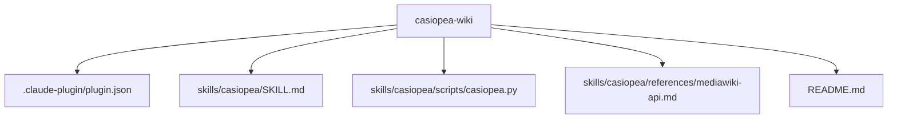

# casiopea-wiki

Plugin de Claude Code (y Claude Cowork) para leer, consultar, escribir y auditar Casiopea, la wiki de la Escuela de Arquitectura y Diseno de la PUCV [^1]. Se instala con el nombre `casiopea`, por lo que sus comandos quedan como `/casiopea:leer`, `/casiopea:consultar`, `/casiopea:escribir` y `/casiopea:auditar`.

## Que hace

Casiopea es la carpeta colectiva de la e[ad] y esta implementada en Semantic MediaWiki [^2], por lo que ademas de busqueda full-text admite consultas estructuradas sobre las propiedades de cada pagina. Cuando este plugin esta instalado y el usuario menciona Casiopea, una pagina de la wiki, una travesia, una etapa, una observacion u otro contenido propio de la enciclopedia, Claude carga el skill `casiopea` y puede:

- buscar paginas por palabras clave (`search`)
- recuperar el contenido wikitexto de una pagina (`page`)
- listar las paginas de una categoria (`category`)
- listar las paginas que enlazan a una pagina dada (`backlinks`)
- ejecutar queries semanticas SMW del tipo `[[Category:Travesia]][[Tiene destino::Patagonia]]` (`ask`)
- inspeccionar las propiedades semanticas de una pagina (`browse`)
- exportar resultados a JSON o CSV listo para abrir en Excel o Numbers

El skill no escribe en la wiki: solo lee. Se autentica como bot para evitar limites de rate y para identificar el origen de las consultas en los logs de la wiki.

## Requisitos

1. **Cuenta de Casiopea con permisos de bot.**

2. **Bot password en `Special:BotPasswords`** dentro de la wiki, otorgando los grants:

   - `Read pages` (imprescindible)
   - `Edit existing pages` (si quieres habilitar escritura)
   - `Create, edit, and move pages` (si quieres crear paginas nuevas)
   - `Upload files` (si quieres subir archivos)
   - `Delete pages` (si quieres habilitar borrado)

3. **Carpeta dedicada con las credenciales** en una ubicacion estable de tu Mac. Recomendado:

   ```bash
   mkdir -p ~/Sites/casiopea-skill
   nano  ~/Sites/casiopea-skill/credentials
   ```

   Contenido:

   ```ini
   CASIOPEA_BOT_USER=Usuario@NombreBot
   CASIOPEA_BOT_PASS=la-contrasena-larga-de-bot-password
   ```

   Permisos restrictivos:

   ```bash
   chmod 600 ~/Sites/casiopea-skill/credentials
   ```

   Cuando uses el skill desde Cowork en cualquier proyecto, monta esta carpeta. El script la detecta automaticamente buscando en cualquier mount cuyo nombre contenga `casiopea`.

4. **Variables de entorno como alternativa.** Si prefieres no usar archivo:

   ```bash
   export CASIOPEA_BOT_USER="Usuario@NombreBot"
   export CASIOPEA_BOT_PASS="la-contrasena-larga"
   ```

   El formato `Usuario@NombreBot` es obligatorio en MediaWiki para bot passwords.

5. **Python 3** disponible en el entorno (incluido por defecto en Cowork). El script usa solo la libreria estandar (`urllib`, `json`, `csv`, `argparse`); cero dependencias externas.

## Salvaguarda para escrituras

Toda operacion de escritura (`edit`, `append`, `create`, `upload`) por defecto hace un dry-run: solo describe lo que haria, sin tocar la wiki. Para que la operacion se ejecute realmente hay que pasarle `--confirm` explicitamente. El skill de Claude esta instruido para mostrarte el contenido exacto y pedirte confirmacion en el chat antes de invocar el comando con `--confirm`.

## Instalacion

**Claude Code.** Agregar el marketplace local e instalar el plugin:

```bash
claude plugin marketplace add /ruta/al/repo/casiopea-skill
claude plugin install casiopea@ead-pucv
```

Luego `/reload-plugins` (o reiniciar) para que los comandos queden activos.

**Claude Cowork.** Doble clic sobre `casiopea-wiki.plugin`, o arrastrarlo a la ventana de chat.

## Comandos

El plugin expone cuatro comandos, todos prefijados por `/casiopea:`. Cada uno carga el skill `casiopea`, resuelve la ruta al script y verifica credenciales; luego interpreta el texto que escribas como instruccion en lenguaje natural.

| Comando | Para que | Verbos del CLI |
|---|---|---|
| `/casiopea:leer` | leer/buscar/traer contenido (solo lectura) | search, page, category, backlinks, browse, history |
| `/casiopea:consultar` | query semantica SMW + exportar CSV/JSON | ask |
| `/casiopea:escribir` | editar/crear/mover/subir/borrar (dry-run → diff → confirmar) | edit, append, create, move, upload, delete |
| `/casiopea:auditar` | monitoreo e impacto, rol admin (solo lectura) | recentchanges, transclusions, fileusage, history |

Ejemplos:

```text
/casiopea:leer trae la pagina Amereida
/casiopea:consultar travesias por anio con destino y profesores, a CSV
/casiopea:escribir agrega una seccion Notas a la pagina X
/casiopea:auditar quien usa la Plantilla:Persona2
```

No es obligatorio escribir un comando: el skill `casiopea` tambien se autoactiva cuando mencionas Casiopea, una travesia, una observacion u otro contenido de la wiki.

## Uso

Una vez instalado, el skill se activa automaticamente cuando el usuario menciona Casiopea, o se puede invocar explicitamente con `/casiopea:leer`, `/casiopea:consultar`, `/casiopea:escribir` o `/casiopea:auditar`. Ejemplos de prompts:

- "busca en Casiopea paginas sobre Travesias 2018"
- "traeme el contenido de la pagina Amereida en Casiopea"
- "lista las paginas de la categoria Ciudad Abierta"
- "dame todas las travesias de la categoria Travesia con su destino y ano, en CSV"
- "que propiedades semanticas tiene la pagina Amereida"
- "agrega esta seccion a la pagina X de Casiopea" (te pedira confirmacion)
- "crea una pagina en Casiopea titulada Y con este contenido" (te pedira confirmacion)

Tambien se puede invocar el CLI directamente desde una terminal:

```bash
CASIOPEA=/var/folders/dk/b0hdr3g14m58xvch43cw52hm0000gn/T/claude-hostloop-plugins/8139d02ddc034f43/skills/casiopea/scripts/casiopea.py

# Lectura
python $CASIOPEA search "Travesia"
python $CASIOPEA page "Amereida"
python $CASIOPEA category "Ciudad Abierta"
python $CASIOPEA backlinks "Amereida"
python $CASIOPEA ask '[[Category:Travesia]]|?Tiene destino|?Tiene ano' --format csv
python $CASIOPEA browse "Amereida"

# Escritura (siempre con --confirm para que se ejecute de verdad)
echo "== Notas ==" | python $CASIOPEA append "Mi pagina de pruebas" --confirm
python $CASIOPEA create "Mi pagina nueva" --from-file borrador.txt --confirm
python $CASIOPEA upload diagrama.png --comment "Diagrama de la propuesta" --confirm
```

## Estructura



## Seguridad

- Las credenciales nunca se persisten en archivos del plugin.
- El bot solo necesita el grant de lectura. No se otorga permiso de edicion.
- Las llamadas usan HTTPS al endpoint `https://wiki.ead.pucv.cl/api.php`.

[^1]: Casiopea es la enciclopedia colaborativa de la e[ad] PUCV, basada en MediaWiki, donde estudiantes y profesores publican proyectos, travesias, observaciones y bibliografia desde el ano 2007 aproximadamente.

[^2]: Semantic MediaWiki (SMW) extiende MediaWiki anotando paginas con propiedades tipadas. Una propiedad como `Tiene destino::Patagonia` declara un dato consultable, no solo texto. La sintaxis `#ask: [[Category:Travesia]][[Tiene destino::Patagonia]]` devuelve la lista de paginas que cumplen ambas condiciones.
