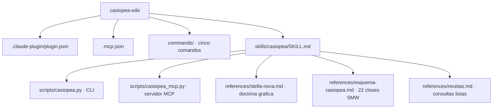

# casiopea-wiki

Plugin para leer, consultar, auditar, maquetar y escribir en Casiopea, la wiki de la Escuela de Arquitectura y Diseño de la PUCV [^casiopea]. Se instala con el nombre `casiopea`, así que sus comandos quedan como `/casiopea:leer`, `/casiopea:consultar`, `/casiopea:maquetar`, `/casiopea:escribir` y `/casiopea:auditar`.

## Antes de instalarlo: entiende con qué cuenta actúa

Este plugin no tiene identidad propia. Se autentica con un **bot password** que tú creas desde **tu** cuenta en [Special:BotPasswords](https://wiki.ead.pucv.cl/Special:BotPasswords). Consecuencia directa: cada edición que haga el agente aparece en el historial público de Casiopea firmada con tu nombre de usuario, junto a las 27.000 ediciones que ya hiciste a mano.

Lo cual es fantástico hasta el día en que el agente reemplaza el contenido de una plantilla compartida y la wiki, muy amablemente, le explica a toda la escuela quién fue.

Por eso el plugin está construido así:

- Ninguna escritura se ejecuta a la primera. Sin `--confirm` hace un **ensayo** e imprime el diff exacto.
- Antes de destruir algo hay comandos que miden el impacto (`transclusions`, `fileusage`) y responden con un número, no con una opinión.
- Antes de publicar contenido maquetado hay un comando que lo **renderiza contra la wiki real sin guardarlo** (`parse`), y delata plantillas inexistentes y enlaces rotos.

Todo eso sirve exactamente en la medida en que leas lo que te muestra. Lee el diff. Tú eres el responsable, no el modelo.

## Requisitos

1. **Cuenta de Casiopea.**

2. **Un bot password** creado en [Special:BotPasswords](https://wiki.ead.pucv.cl/Special:BotPasswords), con los grants que realmente necesites:

   | Grant | Habilita | Recomendación |
   |---|---|---|
   | Basic rights | leer | siempre |
   | Edit existing pages | `edit`, `append`, `purge` | si vas a editar |
   | Create, edit, and move pages | `create`, `move` | si vas a crear |
   | Upload new files | `upload`, `upload-from-url` | si vas a subir archivos |
   | Delete pages | `delete`, `undelete` | solo si de verdad |

   Empezar con lectura y agregar grants cuando hagan falta cuesta un minuto. El camino inverso cuesta una disculpa por correo.

3. **Credenciales en disco**, con permisos restrictivos:

   ```bash
   mkdir -p ~/Sites/casiopea-skill
   cat > ~/Sites/casiopea-skill/credentials <<'EOF'
   CASIOPEA_BOT_USER=TuCuenta@nombre-del-bot
   CASIOPEA_BOT_PASS=la-contrasena-larga
   EOF
   chmod 600 ~/Sites/casiopea-skill/credentials
   ```

   El formato `Usuario@NombreBot` es obligatorio. Escribir solo `Usuario` produce un `WrongPass` que parece una contraseña mal copiada y no lo es.

   Al usar el skill desde Cowork, monta esta carpeta: el script detecta automáticamente cualquier carpeta montada cuyo nombre contenga `casiopea`.

4. **Python 3.10 o superior.** El script usa solo biblioteca estándar; cero dependencias externas, a propósito, para que el plugin sea portable y no envejezca mal.

## Instalación

**Claude Code:**

```bash
claude plugin marketplace add /ruta/al/repo/casiopea-skill
claude plugin install casiopea@ead-pucv
# luego /reload-plugins, o reiniciar
```

**Claude Cowork:** doble clic sobre `casiopea-wiki.plugin`, o arrastrarlo a la ventana de chat.

**Clientes MCP:** el plugin declara su servidor en `.mcp.json`. Si tu cliente no lee plugins, apúntalo directo:

```json
{
  "mcpServers": {
    "casiopea": {
      "command": "python3",
      "args": ["<ruta>/skills/casiopea/scripts/casiopea_mcp.py"],
      "env": { "CASIOPEA_CREDENTIALS": "<ruta>/credentials" }
    }
  }
}
```

**Verificación:**

```bash
python3 skills/casiopea/scripts/casiopea.py doctor
```

## Comandos

| Comando | Para qué | Verbos del CLI |
|---|---|---|
| `/casiopea:leer` | leer, buscar, traer contenido | `search`, `prefix`, `page`, `pages`, `sections`, `revision`, `category`, `backlinks`, `browse`, `history` |
| `/casiopea:consultar` | consulta semántica SMW [^smw] y exportación | `ask`, `properties`, `browse` |
| `/casiopea:maquetar` | diseñar páginas y plantillas en Stella Nova | `parse`, `transclusions`, `page` |
| `/casiopea:escribir` | editar, crear, mover, subir, borrar | `edit`, `append`, `create`, `move`, `upload`, `upload-from-url`, `delete`, `undelete`, `purge` |
| `/casiopea:auditar` | monitoreo, impacto y diagnóstico | `recentchanges`, `history`, `compare`, `transclusions`, `fileusage`, `whoami`, `siteinfo`, `doctor` |

No es obligatorio escribir el comando: el skill se autoactiva cuando mencionas Casiopea, una travesía, una observación, o pides diseñar algo para la wiki.

## El CLI, directo

```bash
CASIOPEA=skills/casiopea/scripts/casiopea.py

# encontrar
python3 $CASIOPEA search "Travesía"
python3 $CASIOPEA prefix "Stella Nova/" --limit 50
python3 $CASIOPEA properties --grep coleccion        # responde: Colección

# leer
python3 $CASIOPEA page "Amereida"
python3 $CASIOPEA sections "Amereida"
python3 $CASIOPEA page "Amereida" --section 3
python3 $CASIOPEA pages "Plantilla:Persona" "Plantilla:Obra"

# consultar
python3 $CASIOPEA ask '[[Categoría:Travesía]][[Año::2018]]|?Destino' --format csv

# auditar
python3 $CASIOPEA transclusions "Plantilla:Persona2"
python3 $CASIOPEA compare 1965943 1965944
python3 $CASIOPEA whoami

# maquetar (no toca la wiki)
python3 $CASIOPEA parse --from-file borrador.mw --title "Mi página"

# escribir (siempre --confirm para que ocurra de verdad)
echo "== Notas ==" | python3 $CASIOPEA append "Mi página" --confirm
python3 $CASIOPEA purge "Mi página" --confirm
```

Sin `--confirm`, los verbos de escritura imprimen el ensayo y salen con código 0 sin tocar nada. Es el comportamiento por defecto y no se puede desactivar globalmente, que era justamente la idea.

## Errores, en siete categorías

Cada fallo sale por stderr como `categoria: detalle`. Sirve tanto para una persona como para un agente que necesita decidir sin adivinar:

| Categoría | Salida | Qué significa |
|---|---|---|
| `not_found` | 6 | el título, revisión o archivo no existe |
| `permission_denied` | 7 | falta el grant, o la página está protegida |
| `invalid_input` | 8 | argumentos mal formados |
| `conflict` | 9 | alguien editó mientras tanto, o la página ya existe |
| `authentication` | 4 | credenciales ausentes, mal escritas o expiradas |
| `rate_limited` | 10 | la wiki está frenando al bot |
| `upstream_failure` | 3 | red, modo solo lectura, o algo no clasificado |

## Estructura



## Cortesía de bot

Automática y no configurable: `maxlag=5` y `assert=user` en cada llamada, reintento con backoff exponencial ante `maxlag`, `ratelimited` y HTTP 429/503, y refresco del token CSRF ante `badtoken`. Casiopea es una wiki compartida; el bot se comporta.

[^casiopea]: Casiopea es la enciclopedia colaborativa de la e[ad] PUCV, basada en MediaWiki, donde estudiantes y profesores publican proyectos, travesías, observaciones y bibliografía desde alrededor de 2007. Es la wiki más grande de Chile, lo que significa que un error a escala también lo es.

[^smw]: Semantic MediaWiki extiende MediaWiki anotando páginas con propiedades tipadas. `Destino::Patagonia` no es texto: es un dato consultable. La consulta `[[Categoría:Travesía]][[Destino::Patagonia]]` devuelve la lista de páginas que cumplen ambas condiciones, sin que nadie haya mantenido esa lista a mano.
