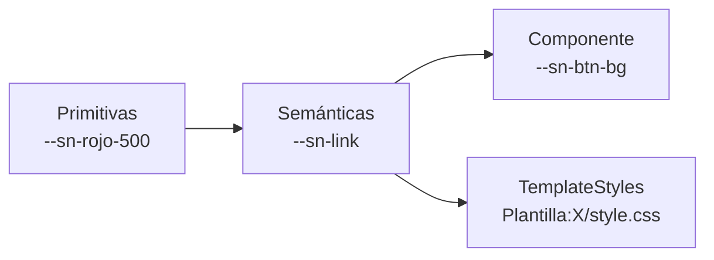

# Stella Nova — doctrina gráfica para escribir en Casiopea

Referencia destilada del skin **Stella Nova** [^repo], el sistema visual de Casiopea. Se carga cuando hay que **maquetar una página, diseñar una plantilla o escribir CSS** para la wiki. Para consultar datos, no hace falta.

Fuentes de verdad, en orden de autoridad:

1. `resources/tokens.css` del repo del skin — la lista canónica de tokens.
2. `docs/WIKITEXTO.md` y `docs/DISENO.md` del repo — la doctrina.
3. Las páginas `[[Stella Nova/*]]` de la wiki de producción — didácticas, con ejemplos renderizados, a veces por delante y a veces por detrás del repo.

Cuando esta referencia y la wiki se contradigan, gana el repo, salvo que la wiki documente una clase que el repo aún no tiene (ha pasado). Regenerar con `casiopea.py sn-sync`.

## 1. La metáfora, en una frase

Una **hoja de papel cálida flotando sobre el campo gris del atelier**, con un único punto de luz carmín (la *nova*) usado con avaricia. Editorial, sobrio, cálido. Todo lo demás se deriva de ahí.

Consecuencias operativas al escribir contenido:

- El fondo nunca es `#fff` y la tinta nunca es `#000`. Son crema y negro cálido.
- El carmín es acento, no relleno. Si aparece dos veces en la misma pantalla, probablemente una sobra.
- Todo el ritmo vertical cae en una retícula (`--sn-baseline`). Los valores en `rem` inventados la rompen.

## 2. La regla de oro para plantillas

**No hardcodear colores. Consumir tokens de la capa semántica con `var(--sn-…)` a secas, sin valor de respaldo.**

```css
/* mal: no respeta el tema, ilegible en modo oscuro */
color: black;
background: #fcfbf7;
border: 1px solid #ddd;

/* bien */
color: var(--sn-ink);
background: var(--sn-paper);
border: 1px solid var(--sn-hairline);
```

El sanitizador de TemplateStyles de Casiopea **rechaza `var(--token, respaldo)`**: si se escribe con fallback, la `/style.css` da error y no se guarda. Esto no es negociable ni tiene workaround elegante [^extender].

Otras cosas que el sanitizador rechaza y que hay que resolver de otro modo:

| Rechazado | Alternativa |
|---|---|
| `var(--x, fallback)` | `var(--x)` desnudo |
| `light-dark(a, b)` | usar un token semántico que ya voltea, p. ej. `--sn-paper-raised` |
| `:is(...)` | repetir el selector |
| `font-stretch: 90%` (porcentaje literal) | clase `fw-90` del skin, o `font-stretch: var(--tu-prop)` |
| división dentro de `calc()` | consumir el submúltiplo ya calculado en el skin (`--sn-baseline-half`) |

Sí acepta `::after`, `position`, `align-self`, `color-mix()` y las *custom properties*.

## 3. Las tres capas de tokens

Modelo Material 3 (*reference → system → component*). La regla operativa: **tocar la capa más alta que resuelva el problema**.



Una plantilla **solo consume la capa semántica**. Nunca una primitiva: la primitiva es paleta interna y se puede reorganizar; el nombre de rol es el contrato estable.

### Semánticas de uso frecuente

| Token | Rol | Valor en claro |
|---|---|---|
| `--sn-paper` | la hoja: fondo por defecto | `#fcfbf7` |
| `--sn-paper-raised` | superficie elevada (tarjetas); voltea sola | blanco / negro cálido |
| `--sn-sunk` | hundido: cabecera de tabla, `input`, código | `#efece2` |
| `--sn-edit-surface` | área de edición (`textarea`) | lavado 3% de tinta |
| `--sn-field` | el campo detrás de la hoja | `#f4f2ed` |
| `--sn-ink` | texto principal (negro cálido) | `#221f1a` |
| `--sn-ink-soft` | secundario, metadatos, leyendas | `#6b6357` |
| `--sn-ink-faint` | terciario, *placeholder*, deshabilitado | `#968c7c` |
| `--sn-hairline` | filete de 1px | `#ddd6c7` |
| `--sn-hairline-soft` | filete aún más tenue | `#e7e1d3` |
| `--sn-nova` | el acento carmín, con avaricia | `#ae2d13` |
| `--sn-nova-ink` | texto sobre fondo nova | `#ffffff` |
| `--sn-nova-wash` | lavado del acento (selección, activo) | `#f7e9e6` |
| `--sn-link` / `-hover` / `-visited` | enlaces | `#ae2d13` / `#962c08` / `#612403` |
| `--sn-link-new` | redlink (página inexistente) | `#a94f66` |
| `--sn-ok` / `--sn-ok-wash` | éxito: texto / fondo suave | `#2f6f43` |
| `--sn-warn` / `--sn-warn-wash` | aviso | `#8a5a12` |
| `--sn-danger` / `--sn-danger-wash` | error | `#b21e3e` |
| `--sn-icon` / `--sn-icon-active` | íconos de UI (nunca carmín) | tinta 55% / tinta plena |

### Forma, espacio y retícula

| Token | Valor | Para qué |
|---|---|---|
| `--sn-radius` | `4px` | radio estándar (`-s` 2px, `-l` 8px, `-pill` 999px) |
| `--sn-s-1` … `--sn-s-6` | `.25rem` … `2.25rem` | escala de espaciado, fija en `rem` |
| `--sn-baseline` | interlínea del cuerpo | **unidad del ritmo vertical**, reactiva al tamaño de letra del lector |
| `--sn-baseline-half` / `-2` / `-3` | múltiplos | relleno vertical que debe cerrar en baselines enteras |

Distinción que se olvida y arruina la retícula: `--sn-s-*` **no sigue** a `--sn-font-scale`. Para el relleno vertical de una tarjeta que debe cerrar en un número entero de líneas base, usar `--sn-baseline-half`, nunca `--sn-s-3`.

### Tipografía

Primitivas: `--sn-font-sans` (IBM Plex Sans), `--sn-font-serif` (Roboto Serif), `--sn-font-mono` (IBM Plex Mono). Semánticas, que son las que se usan:

- `--sn-font-text` — cuerpo, UI y **todas** las cabeceras h1–h6. Voltea a serif si el lector lo elige.
- `--sn-font-display` — alias de `--sn-font-text`. La doctrina es "todo sans en cabeceras".
- `--sn-font-quote` — `<blockquote>` y `<poem>`. Es la familia *contraria* al cuerpo, para mantener contraste editorial.

El cuerpo corre condensado (`--sn-text-width`, 80% por defecto). **La familia la elige el lector, no quien escribe**: no diseñar nada que dependa de que el cuerpo sea sans.

## 4. Clases opt-in del skin (se escriben en el wikitexto)

El conjunto se mantiene **chico a propósito**. Antes de pedir una clase nueva, verificar que ninguna de estas sirva.

### `grid` / `grilla` — el framework de maquetación

Bilingüe y equivalente: `grid` es el canónico, `grilla` el alias retrocompatible. Cada **hijo directo** del contenedor es una celda. Los modificadores se combinan sumando clases.

```wiki
<div class="grid cols-3 gap-l align-center">
[[Archivo:a.jpg]]
[[Archivo:b.jpg]]
[[Archivo:c.jpg]]
</div>
```

| Grupo | Clases | Qué hace |
|---|---|---|
| Columnas | `cols-1` … `cols-6` | N columnas iguales |
| Columnas | `cols-auto` | tantas columnas (≥ 16 rem) como quepan, *auto-fit* |
| Columnas | `cols1-2` / `cols2-1` | asimétricas, 1/3+2/3 y 2/3+1/3 |
| Espaciado | `gap-0` `gap-s` `gap-m` `gap-l` | 0 / .5 / 1 / 2.25 rem (sin clase: 1.5 rem) |
| Espaciado | `gap-h-*` / `gap-v-*` | gap por eje, misma escala |
| Flujo | `flujo-v` / `stack` | apila en una columna vertical |
| Alineación | `align-top` `align-center` `align-bottom` `align-baseline` | alias `arriba` `centro` `abajo` |
| Margen | `sin-margen` / `flush` | anula el margen vertical |
| Ancho | `full` / `completa` | rompe el ancho de lectura, ocupa todo el campo |

Colapso responsive, automático: bajo 64 rem las densas (`cols-4/5/6`) reducen columnas; bajo 48 rem todas caen a una sola.

Dos trampas conocidas:

- **Contenido inline** (varios `<span>` o enlaces seguidos): MediaWiki lo envuelve todo en **un solo `<p>`**. El skin lo detecta cuando ese `<p>` es el único hijo y lo hace transparente, así que funciona. Separar los ítems con líneas en blanco también funciona (un `<p>` por ítem) pero suele quedar peor.
- **`flujo-v` pone `break-inside: avoid` a los hijos directos.** Un `#ask` con `format=ul` no se reparte en columnas dentro de una grilla: usar `format=template` con una plantilla de tarjeta.

### `full-width` — imagen a sangre

Revienta el padding lateral de la hoja. Tres formas válidas:

```wiki
[[Archivo:foo.jpg|class=full-width]]
[[Archivo:foo.jpg|frameless|class=full-width]]
<div class="full-width">[[Archivo:foo.jpg]]</div>
```

Consecuencias: la imagen se estira al 100% del nuevo ancho, así que **el original debe tener al menos 1600 px** o se pixela. Si es el primer elemento del cuerpo, también revienta el padding superior (efecto *hero*) y **choca con el `firstHeading`**: combinar con `__NOTITLE__`. La leyenda del thumb se mantiene al ancho de lectura, a propósito.

### `fondo-*` — bandas a sangre lateral

Fondo de lado a lado, contenido de vuelta al ancho de lectura. El alto es múltiplo entero de `--sn-baseline`, así que no rompe la retícula. Se combina con `grid`.

| Clase | Efecto |
|---|---|
| `fondo-ahuesado` | hueso claro |
| `fondo-coral` | lavado carmín |
| `fondo-verde` | lavado verde |
| `fondo-ambar` | lavado ámbar (rol *warn*) |
| `fondo-info` | lavado info |
| `fondo-noche` | fuerza tema **oscuro** en todo el bloque |
| `fondo-dia` | fuerza tema **claro** |
| `fondo-opuesto` | **invierte** respecto al tema vigente |

Las tres últimas redefinen el esquema de color del bloque completo, no solo el fondo.

### Las demás

| Clase | Qué hace | Nota |
|---|---|---|
| `template` / `plantilla` | sobre `<table class="wikitable template">`: ficha vertical clave→valor, sin filetes, etiqueta a la derecha en versalita | siempre combinada con `wikitable` |
| `img-circle` | recorte circular limpio; mueve el `clip-path` al `` y oculta el `figcaption` | subir imágenes cuadradas |
| `sn-notice` | aviso editorial: filete carmín a la izquierda, fondo lavado | una sola variante, a propósito |
| `wiki-btn` | botón píldora *outline*; variantes `red` y `green` | alto exacto de una línea base; debe vivir en `.sn-body` |
| `fw-50` … `fw-150` | ancho de fuente por el eje `wdth` | ver la trampa abajo |
| `noprint` | desaparece al imprimir o exportar a PDF | estándar de MediaWiki |

**Trampa de `fw-*`:** la escala declarada va 50–150 pero el navegador clampa al rango real del `woff2`. IBM Plex Sans solo da **75–100**; Roboto Serif, **62.5–100**. Y la familia la elige el lector. Si se necesita un ancho fuera de 75–100, hay que fijar la familia en el mismo elemento (`class="serif fw-130"`) o el resultado depende de la preferencia ajena.

### Clases tipográficas (viven en `MediaWiki:Common.css`, no en el skin)

Ortogonales y combinables (`class="lg serif center nova"`). Una clase en el `<div>` se hereda al `<p>` interno.

| Eje | Clases |
|---|---|
| Tamaño | `jumbo` · `lg` · `sm` · `xs` (el cuerpo es el default) |
| Familia | `serif` · `sans` · `mono` |
| Énfasis | `uppercase` · `italic` · `bold` |
| Alineación | `left` · `center` · `right` · `justify` |
| Color | `nova` · `ok` · `warn` · `danger` |

Estas **no las define el skin**. Si una wiki no las tiene en su `Common.css`, no existen.

## 5. Palabras mágicas

Sensibles a mayúsculas: `__pantallacompleta__` no hace nada.

- `__PANTALLACOMPLETA__` (sinónimo `__FULLSCREEN__`, provista por el skin) — modo lienzo. Suprime cabecera, pie, panel de preferencias y portlets; el contenedor pasa de `.sn-paper` a `.sn-canvas`, a ancho de viewport. Para `<canvas>`, p5.js, portadas a borde de pantalla. **No oculta el título por sí sola.** Se pierde la pestaña "Editar": para editar hay que ir por `?action=edit`.
- `__NOTITLE__` (extensión NoTitle) — oculta el `firstHeading`. Necesaria junto a `full-width` en el primer elemento.
- `__TOC__` / `__NOTOC__` / `__FORCETOC__` — el skin **respeta la posición** que les da MediaWiki y solo restiliza. No hay slot fijo de TOC.
- `__NOEDITSECTION__` — el skin estiliza los enlaces `[editar]` pero no los inventa.

Combinación canónica para una portada a sangre: `__NOTITLE__` + `__PANTALLACOMPLETA__` + primera imagen `full-width`.

## 6. Comportamientos automáticos (no requieren clase)

- Párrafos del cuerpo justificados con hyphenation automática (depende de `lang="es"`).
- `.wikitable`, `.smwtable` y `.broadtable` ya vienen tematizadas: **solo filetes horizontales**, sin contorno exterior, sin colores alternados, cabecera transparente, texto a ~80%. No hay que estilizarlas.
- **El skin pone `display: block` a las tablas** (para el scroll horizontal en móvil). Si una tabla debe estirar sus columnas al 100%, hay que devolverle `display: table` con un selector acotado.
- `<blockquote>` y `<poem>` toman la familia de contraste. No usar `<blockquote>` para "destacar texto": está reservado para citas reales.
- Imágenes: `max-width: 100%` y `height: auto` automáticos.
- Enlaces externos: ícono Feather como máscara teñida con `currentColor`.

## 7. Convenciones al crear una plantilla nueva

Ruta canónica de la hoja: `Plantilla:X/style.css`, en singular y en español. Se invoca con:

```wiki
<templatestyles src="Plantilla:X/style.css" />
```

Cuando varias plantillas comparten lenguaje visual, conviene una **hoja compartida** que todas invoquen, en vez de duplicar reglas [^malla].

Checklist antes de guardar:

1. ¿Todos los colores son `var(--sn-…)` semánticos, sin fallback?
2. ¿El relleno vertical usa `--sn-baseline*` y no `--sn-s-*`?
3. ¿Hay algún `:is()`, `light-dark()` o porcentaje de `font-stretch`? El sanitizador los va a rechazar.
4. ¿Se probó **transcluida en una página real**, no mirando `Plantilla:X`? El namespace `Plantilla:` tiene otro layout y miente.
5. ¿Se probó en tema oscuro? Con `?useskin=stellanova` y el conmutador del menú de usuario.
6. ¿Se probó con `?debug=true`? ResourceLoader cachea con saña y hace creer que un cambio no funcionó.

## 8. Antes de inventar algo nuevo

El set de tokens y clases se mantiene chico deliberadamente. Bootstrap enseñó qué pasa cuando crece sin freno. El orden de preguntas:

1. ¿Lo cubre un token existente?
2. ¿Lo cubre una clase existente (`grid`, `full-width`, `fondo-*`, `plantilla`, `img-circle`, `sn-notice`, `wiki-btn`)?
3. Si no, **conversarlo antes de añadirlo**. Un agente no inventa tokens ni clases del skin por su cuenta: propone y espera.

Y si hay que tocar un color, decidir **en qué capa**: reusar la primitiva que ya existe; reasignar el rol si es cuestión de semántica; ajustar el componente si es un widget concreto.

[^repo]: Repositorio del skin: `https://github.com/hspencer/stella-nova`. La página de producción `[[Stella Nova]]` cita `eadpucv/stella-nova` y una versión antigua; el repositorio vigente es el primero.

[^extender]: La wiki tiene instalada `TemplateStylesExtender`, que es lo que permite *custom properties* dentro de TemplateStyles. Sin esa extensión el sanitizador descartaría los `var()` en silencio, que es peor que fallar.

[^malla]: Precedente: `Plantilla:Malla Curricular/style.css` sirve tanto a `.malla` como a `.programa`, invocada desde ambas plantillas.
